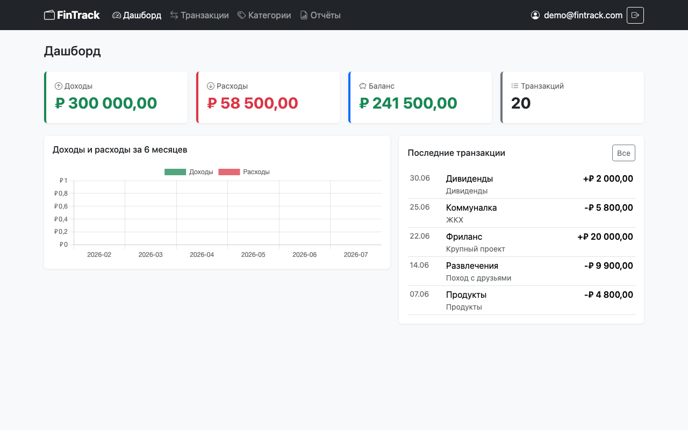
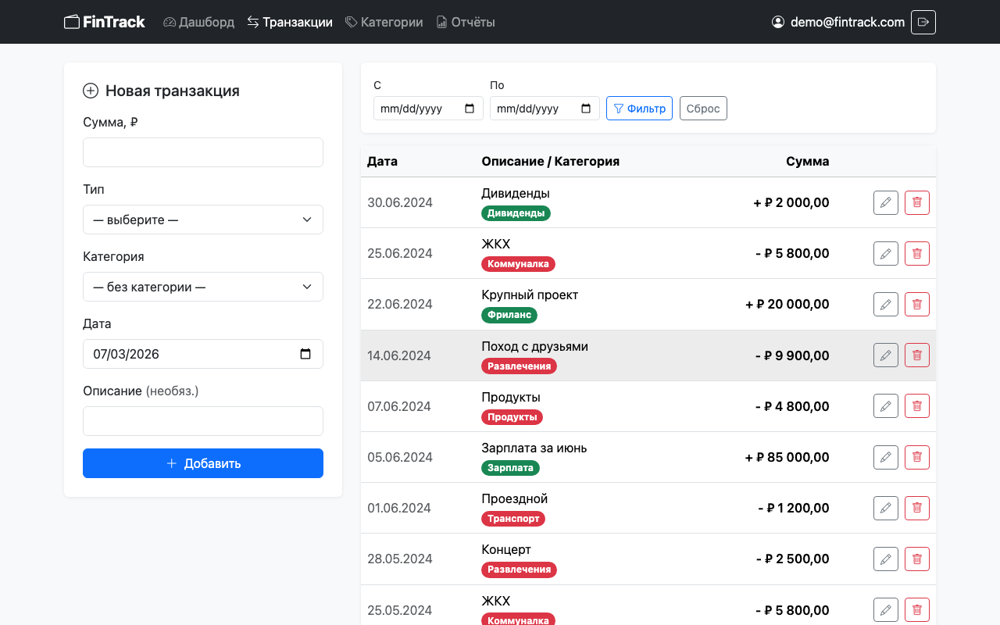
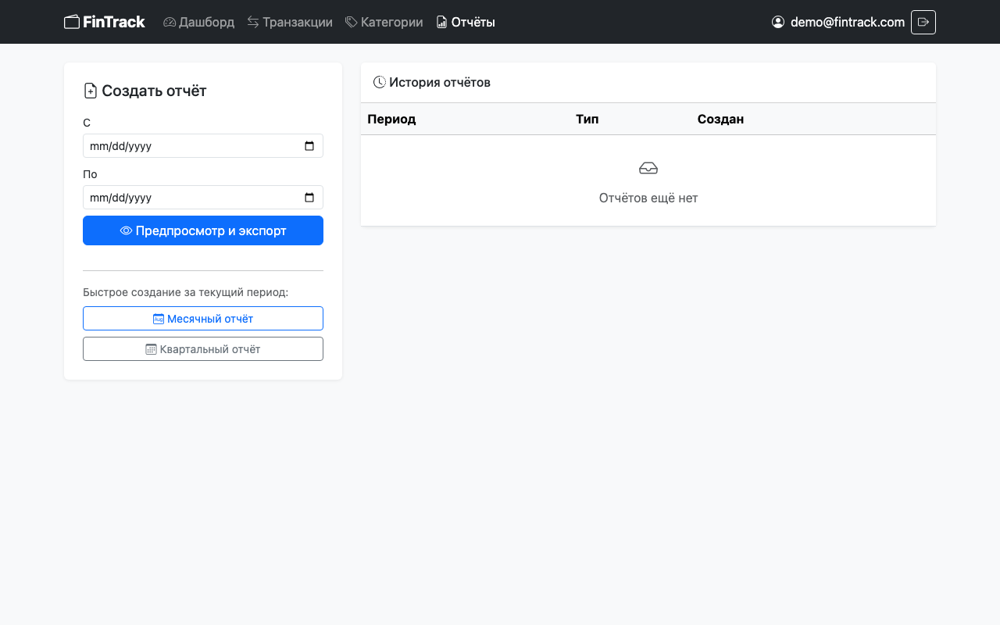
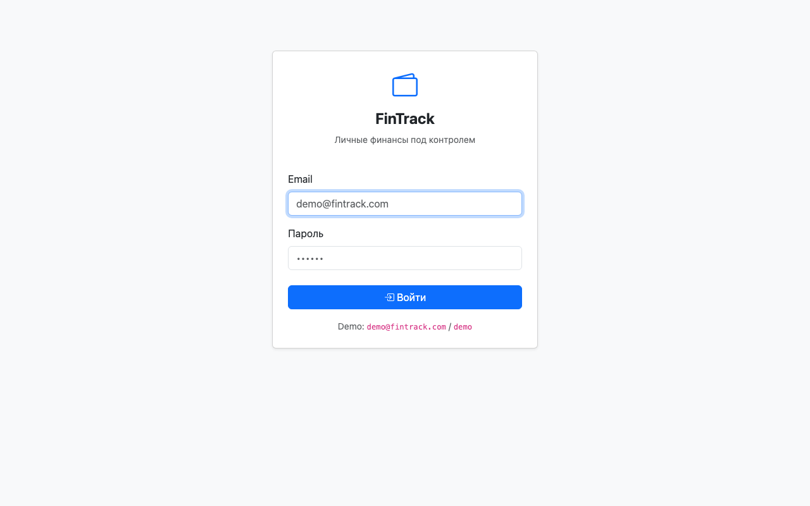

# FinTrack — Personal Finance Tracker

Веб-приложение для учёта личных финансов: доходы, расходы, аналитика по периодам, тренды, экспорт отчётов в PDF и Excel.

Собрано как учебный портфельный проект — покрывает полный стек Spring Boot-приложения от слоя данных до аутентификации и тестов.

## Стек

| Слой | Технологии |
|------|-----------|
| Язык / платформа | Java 17, Maven |
| Фреймворк | Spring Boot 3.2, Spring MVC, Spring Data JPA, Spring JDBC |
| База данных | PostgreSQL, Flyway (миграции) |
| Безопасность | Spring Security 6, BCrypt |
| Шаблонизатор | Thymeleaf 3.1 + Spring Security extras |
| Фронтенд | Bootstrap 5, Chart.js, Bootstrap Icons |
| Экспорт | iText 7 (PDF), Apache POI (Excel) |
| Тесты | JUnit 5, Mockito, Spring MockMvc |

## Быстрый старт

### Требования

- Java 17+
- Maven 3.8+
- PostgreSQL 14+

### 1. База данных

```bash
psql -U postgres -c "CREATE DATABASE fintrack_dev;"
```

### 2. Настройка подключения

Файл `src/main/resources/application-dev.properties` — замени под свои данные, если пользователь/пароль PostgreSQL отличается:

```properties
spring.datasource.url=jdbc:postgresql://localhost:5432/fintrack_dev
spring.datasource.username=postgres
spring.datasource.password=postgres
```

### 3. Запуск

```bash
mvn spring-boot:run
```

Flyway автоматически создаст схему и заполнит тестовыми данными. Приложение доступно: **http://localhost:8080**

### Учётные данные для входа

| Поле | Значение |
|------|---------|
| Email | `demo@fintrack.com` |
| Пароль | `demo` |

## Сборка и запуск JAR

```bash
# Сборка
mvn clean package -DskipTests

# Запуск (dev-профиль, нужен запущенный PostgreSQL)
java -jar target/fintrack-0.0.1-SNAPSHOT.jar

# Запуск с prod-профилем (параметры БД через env-переменные)
export DB_URL=jdbc:postgresql://localhost:5432/fintrack_prod
export DB_USERNAME=postgres
export DB_PASSWORD=secret
java -jar target/fintrack-0.0.1-SNAPSHOT.jar --spring.profiles.active=prod
```

## Функциональность

- **Аутентификация** — form login с BCrypt, защита всех маршрутов
- **Дашборд** — баланс, доходы/расходы, последние транзакции, график трендов за 6 месяцев
- **Транзакции** — создание, редактирование, удаление, фильтрация по датам
- **Аналитика** — метрики за период, разбивка по категориям
- **Категории** — управление категориями доходов и расходов
- **Профиль** — просмотр данных пользователя
- **Экспорт** — PDF и Excel отчёты за выбранный период
- **REST API** — JSON-эндпоинты для транзакций и аналитики (`/api/**`)

## Структура проекта

```
src/
├── main/
│   ├── java/com/fintrack/
│   │   ├── controller/     # MVC-контроллеры (Thymeleaf) и REST-контроллеры
│   │   ├── dao/            # JDBC-слой для Report (Spring JdbcTemplate)
│   │   ├── dto/            # DTO с Bean Validation аннотациями
│   │   ├── exception/      # ResourceNotFoundException, GlobalExceptionHandler
│   │   ├── model/          # JPA-сущности: User, Transaction, Category; POJO: Report
│   │   ├── repository/     # Spring Data JPA репозитории
│   │   ├── security/       # SecurityConfig, UserDetailsServiceImpl
│   │   └── service/        # Бизнес-логика, экспорт PDF/Excel
│   └── resources/
│       ├── db/migration/   # Flyway: V1 схема, V2 сиды, V3 пароль
│       ├── static/         # CSS (app.css), JS, images (favicon.svg)
│       └── templates/      # Thymeleaf-шаблоны + фрагменты
└── test/
    └── java/com/fintrack/
        ├── service/        # Unit-тесты сервисов (Mockito)
        └── controller/     # WebMvcTest тесты контроллеров
```

## Скриншоты

> Скриншоты нужно сделать вручную и положить в `docs/screenshots/` с этими именами файлов.

**Дашборд** — баланс, тренды, последние транзакции:


**Транзакции** — список с формой добавления/редактирования:


**Отчёты** — история с кнопками скачивания PDF/Excel:


**Вход** — страница авторизации:


## Тесты

```bash
# Запуск всех тестов
mvn test

# Только конкретный класс
mvn test -Dtest="TransactionServiceTest"
```

56 тестов: 28 unit-тестов сервисного слоя + 28 MockMvc-тестов контроллеров.
Плюс 1 smoke-тест (`@Disabled`) — требует запущенного PostgreSQL, запускается вручную.

## Профили Spring

| Профиль | Назначение | Активация |
|---------|-----------|-----------|
| `dev` | Локальная разработка, verbose SQL-лог | По умолчанию |
| `prod` | Продакшн, параметры БД из env-переменных | `--spring.profiles.active=prod` |

## Прогресс разработки

- [x] Этап 0: Инициализация проекта (Spring Initializr, структура пакетов)
- [x] Этап 1: Слой данных (JPA-сущности, репозитории, Flyway-миграции)
- [x] Этап 2: Сервисный слой + бизнес-логика
- [x] Этап 3: MVC-контроллеры и Thymeleaf-шаблоны
- [x] Этап 4: REST API + экспорт PDF/Excel
- [x] Этап 5: JS-слой (AJAX, Chart.js, уведомления)
- [x] Этап 6: Тесты (Unit + MockMvc)
- [x] Этап 7: Spring Security (аутентификация, CSRF, BCrypt)
- [x] Этап 8: Финальная документация и сборка
- [x] Этап 9: Security-фикс (IDOR в GET /api/transactions/{id}), редактирование транзакций, скачивание отчётов из истории
